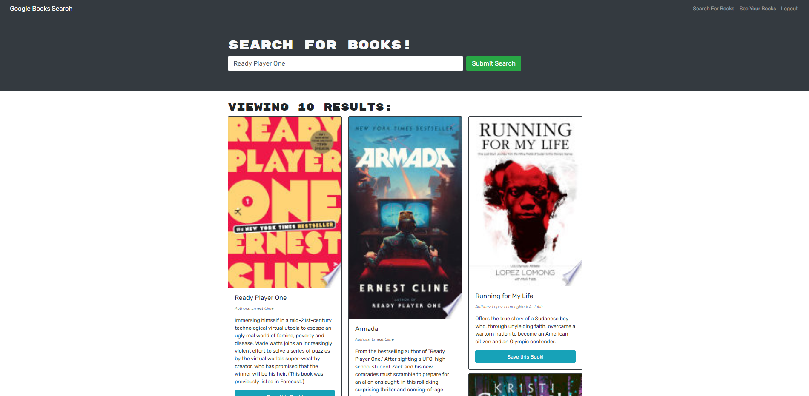
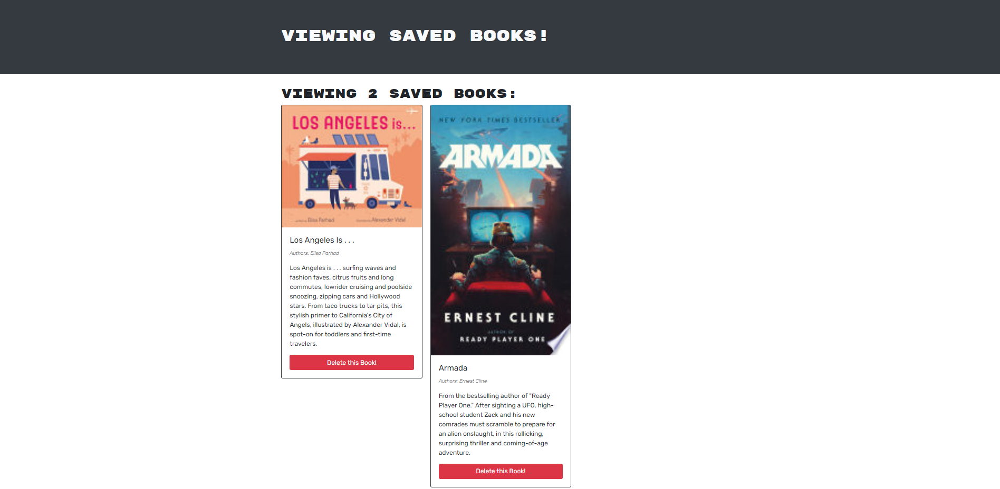

# 📚📚 Book Search Engine 3000 📚📚

**Live Deployment:** https://tranquil-wave-08798.herokuapp.com/

**Github Repo:** https://github.com/jwilferd10/Book-Search-3000

## Table of Contents :
  - [Preview](#camera-preview)
  - [Description](#description)
  - [User Story](#book-user-story)
  - [Resources Used](#floppy_disk-resources-used)
  - [Installation](#minidisc-installation-and-usage)
  - [Contact Information](#e-mail-contact-information)

## :camera: Preview:

### Homepage:

### Saved Books:

### Demo:

## Description:

 I took a fully functioning Google Books API search engine built with a RESTful API, and refactored it to be a GraphQL API built with Apollo Server. The app was built using the MERN stack, with a React front end, MongoDB database, and Node.js/Express.js server and API. It was already set up to allow users to save book searches to the back end. 

 These are the following changes done: 

1) Set up an Apollo Server to use GraphQL queries and mutations to fetch and modify data, replacing the existing RESTful API.

2) Modify the existing authentication middleware so that it works in the context of a GraphQL API.

3) Create an Apollo Provider so that requests can communicate with an Apollo Server.

 Funny enough this is my second attempt trying to get this Search-Engine to work. Originally in my first attempt I ran into a heap of issues then left the project to work on another. After coming back to this project I grew so confused and did not understand where I left off, primarily because of a lack of comments. Because of the mass confusion I decided it'd be better to start the challenge from scratch and retrace my steps on how I set everything up. That made the work process much easier, but I still ran into problems trying to get my Search Engine up and running. Thankfully I was able to sidestep these issues and got everything working! So please, enjoy the Book Search Engine 3000! 

## :book: User Story:
**AS AN avid reader**
- I WANT to search for new books to read
- SO THAT I can keep a list of books to purchase

**GIVEN a book search engine**
- WHEN I load the search engine
  - THEN I am presented with a menu with the options Search for Books and Login/Signup and an input field to search for books and a submit button
- WHEN I click on the Search for Books menu option
  - THEN I am presented with an input field to search for books and a submit button
- WHEN I am not logged in and enter a search term in the input field and click the submit button
  - THEN I am presented with several search results, each featuring a book’s title, author, description, image, and a link to that book on the Google Books site
- WHEN I click on the Login/Signup menu option
  - THEN a modal appears on the screen with a toggle between the option to log in or sign up
- WHEN the toggle is set to Signup
  - THEN I am presented with three inputs for a username, an email address, and a password, and a signup button
- WHEN the toggle is set to Login
  - THEN I am presented with two inputs for an email address and a password and login button
- WHEN I enter a valid email address and create a password and click on the signup button
  - THEN my user account is created and I am logged in to the site
- WHEN I enter my account’s email address and password and click on the login button
  - THEN I the modal closes and I am logged in to the site
- WHEN I am logged in to the site
  - THEN the menu options change to Search for Books, an option to see my saved books, and Logout
- WHEN I am logged in and enter a search term in the input field and click the submit button
  - THEN I am presented with several search results, each featuring a book’s title, author, description, image, and a link to that book on the Google Books site and a button to save a book to my account
- WHEN I click on the Save button on a book
  - THEN that book’s information is saved to my account
- WHEN I click on the option to see my saved books
  - THEN I am presented with all of the books I have saved to my account, each featuring the book’s title, author, description, image, and a link to that book on the Google Books site and a button to remove a book from my account
- WHEN I click on the Remove button on a book
  - THEN that book is deleted from my saved books list
- WHEN I click on the Logout button
  - THEN I am logged out of the site and presented with a menu with the options Search for Books and Login/Signup and an input field to search for books and a submit button 

## :floppy_disk: Resources Used:
    Client Resources:
    "@apollo/react-hooks": "^4.0.0",
    "@testing-library/jest-dom": "^4.2.4",
    "@testing-library/react": "^9.3.2",
    "@testing-library/user-event": "^7.1.2",
    "apollo-boost": "^0.4.9",
    "bootstrap": "^4.4.1",
    "graphql": "^15.5.0",
    "graphql-tag": "^2.11.0",
    "jwt-decode": "^2.2.0",
    "react": "^16.13.1",
    "react-bootstrap": "^1.0.1",
    "react-dom": "^16.13.1",
    "react-router-dom": "^5.1.2"
    "react-scripts": "3.4.1"
    
    Server Resources:
    "apollo-server-express": "^2.23.0",
    "bcrypt": "^5.0.0",
    "express": "^4.17.1",
    "graphql": "^15.5.0",
    "graphql-tag": "^2.11.0",
    "jsonwebtoken": "^8.5.1",
    "mongoose": "^5.12.3"
    
    Main Resources:
    "if-env": "^1.0.4"

## :minidisc: Installation and Usage:
Install this project by clicking the *GREEN* button above, you can download it by ZIP or copy the SSH! Then you'll want to run it by doing npm i, then npm start. Then:
- Sign up/Log in
- Search for books
- Favorite a book
- Check it out in favorites
- Delete a book from favorites

## :e-mail: Contact Information:
- ### [jwilferd10](https://github.com/jwilferd10)
